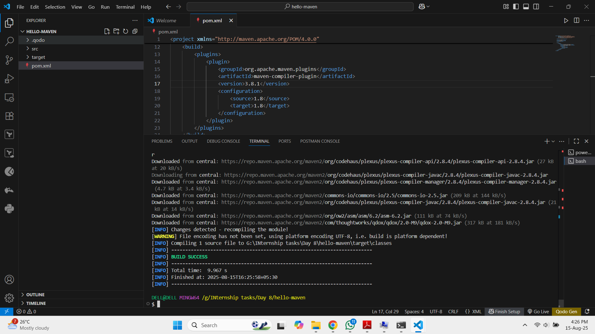
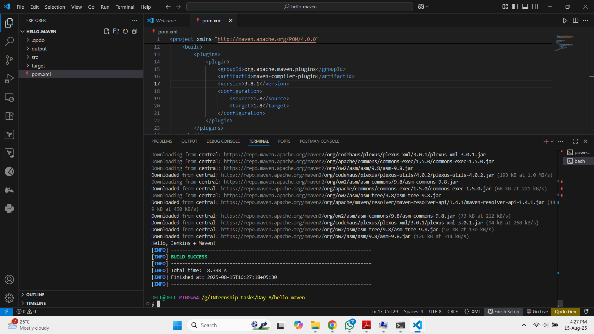
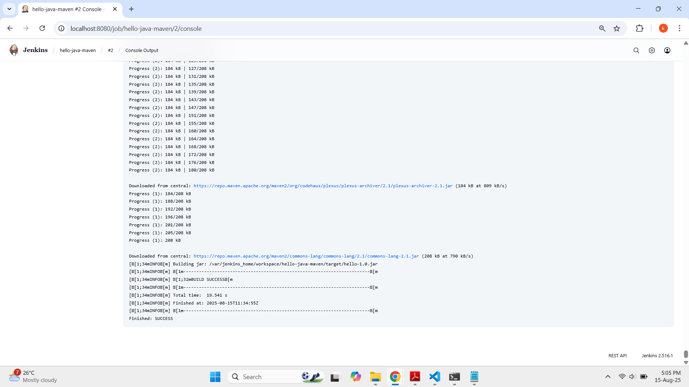

```markdown
# Run a Simple Java Maven Build Job in Jenkins

## 🎯 Objective
Learn how to use Jenkins to build a simple Java application using Maven — your first step into CI/CD.

---

## 🛠️ Tools Required
- **Java JDK** (8 or 11)
- **Maven**
- **Jenkins** (locally installed or via Docker)
- **Git** (optional — can run from local folder)

---

## 📂 Project Structure
```bash

hello-java-maven/
├── src/
│   └── main/
│       └── java/
│           └── HelloWorld.java
└── pom.xml

````

**HelloWorld.java**
```java
public class HelloWorld {
    public static void main(String[] args) {
        System.out.println("Hello, Jenkins + Maven!");
    }
}
````

**pom.xml**

```xml
<project>
    <modelVersion>4.0.0</modelVersion>
    <groupId>com.example</groupId>
    <artifactId>hello</artifactId>
    <version>1.0</version>
    <build>
        <plugins>
            <plugin>
                <groupId>org.apache.maven.plugins</groupId>
                <artifactId>maven-compiler-plugin</artifactId>
                <version>3.8.1</version>
                <configuration>
                    <source>1.8</source>
                    <target>1.8</target>
                </configuration>
            </plugin>
        </plugins>
    </build>
</project>
```

---

## ⚙️ Installation Steps

### **1. Install Java**

**Ubuntu/Debian**

```bash
sudo apt update && sudo apt install openjdk-11-jdk -y
java -version
```

**CentOS/RHEL**

```bash
sudo yum install java-11-openjdk-devel -y
java -version
```

---

### **2. Install Maven**

**Ubuntu/Debian**

```bash
sudo apt update && sudo apt install maven -y
mvn -v
```

**CentOS/RHEL**

```bash
sudo yum install maven -y
mvn -v
```

---

### **3. Install Jenkins**

**Ubuntu/Debian**

```bash
wget -q -O - https://pkg.jenkins.io/debian-stable/jenkins.io.key | sudo apt-key add -
sudo sh -c 'echo deb https://pkg.jenkins.io/debian-stable binary/ > \
    /etc/apt/sources.list.d/jenkins.list'
sudo apt update && sudo apt install jenkins -y
sudo systemctl start jenkins
sudo systemctl enable jenkins
```

**Docker**

```bash
docker run -d \
  -p 8080:8080 -p 50000:50000 \
  -v jenkins_home:/var/jenkins_home \
  jenkins/jenkins:lts-jdk11
```

---

## 🐛 Common Error & Fix

**Error:**

```
Cannot run program "mvn": No such file or directory
```

**Reason:** Maven is not installed in the Jenkins container/agent.

**Fix (Docker Jenkins):**

```bash
# Run as root inside container
docker exec -u 0 -it <jenkins_container_name> bash

apt update && apt install maven -y
mvn -v
exit
```

**Permanent Fix:** Create a custom Jenkins image with Maven installed:

```dockerfile
FROM jenkins/jenkins:lts-jdk11
USER root
RUN apt-get update && apt-get install -y maven
USER jenkins
```

---

## 🚀 Steps to Run Jenkins Job

1. Start Jenkins.
2. Go to **Manage Jenkins → Global Tool Configuration** → Add Maven (e.g., Maven 3.8.6).
3. Create a **New Freestyle Project**.
4. In **Source Code Management**, link your Git repo.
5. In **Build**, choose:

   * Build Step: **Invoke top-level Maven targets**
   * Goals: `clean package`
6. Save and **Build Now**.
7. Check **Console Output** → You should see:

```
[INFO] BUILD SUCCESS
```

---

## 📸 Deliverable

* Screenshot of Jenkins **Console Output** showing `BUILD SUCCESS`.

<div align="center">
  
</div>

<div align="center">
  
</div>

<div align="center">
  
